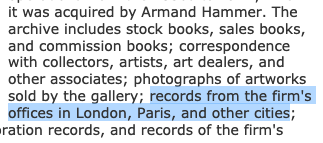

## Foreword

The following walkthrough was made for a [Networked Curator workshop given at the Getty Research Institute, February 8th, 2018](http://networkedcurator.doingdh.org/).

This lesson is derived from a [similar Palladio workshop given at the Frick Digital Art History Lab, April 8th, 2016][amsterdam_palladio].

[amsterdam_palladio]: https://matthewlincoln.net/2016/04/07/exploring-depictions-of-amsterdam-with-palladio.html

## Introduction

Some tips from [Miriam Posner](http://miriamposner.com/blog/getting-started-with-palladio/) before we begin:

>A reminder that Palladio is still under development, so it can be buggy
and slow!
>
>-   Work slowly. Wait for an option to finish loading before you click it again or click something else.
>
>-   **Do not refresh the page.** You'll lose your work.
>
>-   On a related note: To start over, refresh the page.
>
>-   Clicking on the **Palladio** logo will bring you to the Palladio homepage, but it won't erase your work.

Another tip from me: while Palladio _mostly_ works with Firefox, some options like tooltips are a bit buggy in that browser. You'll find more consistent results using Chrome or Safari.

## Download the workshop data

<a href="https://matthewlincoln.net/mapping-knoedler-palladio/nyc_knoedler.csv" download="nyc_knoedler.csv">Download the CSV file that we'll work with.</a>

These data describe a little over 4,700 sales by the fine art dealer M. Knoedler & Co. between roughly 1870-1970, as documented in their stockbooks data as encoded by the [Getty Provenance Index](http://www.getty.edu/research/tools/provenance/search.html).

For more background on the Knoedler archive at the Getty, and the data project to encode the stockbooks from within that collection, see:

- <http://www.getty.edu/research/special_collections/notable/knoedler.html>
- <http://blogs.getty.edu/iris/database-of-knoedler-gallery-stock-books-now-online/>

In order to keep this introductory lesson straightforward, **this is only a tiny slice of the full Knoedler data**, which cover over 40,000 entries.
The data in `nyc_knoedler.csv` covers only those cases in which:

1. The transactions were _actually recorded_ in the Knoedler stockbooks (they didn't always keep good records!)
2. The records contain original purchase _and_ sale dates and prices.
3. The buyer has a known street address located in Manhattan or Brooklyn (i.e. if our only location info says "New York, NY", it is not included in this subset because it doesn't contain street-level precision. **Note: we haven't yet finished entering all the known addresses - bear this in mind when interpreting visualizations!**)

I've also enhanced these data with some important modifications that aren't included in the original Knoedler data:

1. Imputed values for partially-recorded purchase and sale dates, based on location in the archive.
2. To allow comparison of prices over time, we've converted monetary amounts from foreign currencies into USD, and deflated to a dollar value pinned to 1900. (This work masterminded by Sandra van Ginhoven)
3. Generated lat/lon coordinates for street addresses using the [DSK geocoding service](https://cran.r-project.org/web/packages/ggmap/).

For the sake of simplicity, I've drastically trimmed the number of variables for each of these transactions.
This means some complexities that _are_ represented in the Knoedler data, like transactions of multiple objects, as well as joint purchases by Knoedler and another dealer, are flattened here.

The columns in this table include:

| field                | description                                                             |
| -------------------- | ----------------------------------------------------------------------- |
| `title`              | Title of the work (if recorded)                                         |
| `artists`            | Creator(s) of the artwork (if recorded)                                 |
| `artist_nationality` | Creator(s) nationalities (input by modern editors)                      |
| `genre`              | Genre of the work (input by modern editors)                             |
| `object_type`        | e.g. `Painting`, `Drawing`, `Sculpture` (input by modern editors)       |
| `height`             | Height in inches (if recorded)                                          |
| `width`              | Width in inches (if recorded)                                           |
| `area`               | Area in square inches (if recorded)                                     |
| `seller`             | Name of seller (numeric ID if anonymous/unknown)                        |
| `seller_type`        | e.g. `Dealer`, `Museum`, `Artist`, `Collector`                          |
| `buyer`              | Name of buyer (numeric ID if anonymous/unknown)                         |
| `buyer_type`         | e.g. `Dealer`, `Museum`, `Artist`, `Collector`                          |
| `buyer_address`      | Buyer address                                                           |
| `coordinates`        | Coordinates in the format `lat,lon`                                     |
| `purchase_date`      | Date object brought into Knoedler stock in the format `YYYY-MM-DD`      |
| `sale_date`          | Date object sold out of Knoedler stock in the format `YYYY-MM-DD`       |
| `purchase_price`     | Price Knoedler paid to buy the object (normalized to 1900 USD)          |
| `sale_price`         | Price Knoedler received for selling the object (normalized to 1900 USD) |

## Loading our data

Navigate to <http://hdlab.stanford.edu/palladio/> and click on the "Start" button.

Drag the file `nyc_knoedler.csv` into the window where it says "Load .csv or spreadsheet". You should see text fill the box. Click load.

You should now see the data loaded into Palladio. Let's call our project name "Knoedler", and the table name "New York Sales".

## Checking our data

The data view shows the fields (i.e. columns) from our spreadsheet, and also shows what type of variable Palladio has guessed our data are supposed to be. We've got a few text fields here, as well as date fields, and a coordinates field.

Palladio tries to check for some simple irregularities in our data, like odd characters, and it's highlighted those fields with a red dot. We can ignore these dots for now, as all those characters (like commas or dashes in the _title_ field) are there on purpose.

We also have the option to set the Data Type of this field. Normally Palladio will recognize this automatically, but in some cases, we'll find that we need to manually set a field to "Date" when Palladio thinks it is only a "Number".

## Create a map

Now click on the "Map" button. Palladio starts you out with a plain coastline base map. Before adding our own data, we can enhance this base map by adding more "Tiles". Click on "New Layer", then click on the "Tiles" tab. You can see the different tile types to add to the base map - let's add "Streets" by clicking on the "Streets" button. In the "Name" field above, type "Streets", then click "Add Layer". You should now see borders and cities showing up on your base map.

Now it's time to add our own data. Click on "New Layer" again, and click the "Data" tab. We'll be adding "Points" (the default option). Under the name, type "Sales Locations". Click on "Places" and select `coordinates` (the only option, since this is the only data in our table that is formatted as a pair of coordinates). For the tooltip label (what we see when we roll over the points), let's start with `buyer_address`.

Check the box to size points, and do so according to `number of New York Sales`, which will make points bigger when they match more rows in our table. Finish by clicking "Add Layer", and then click on the hamburger button (the three small lines in the upper right corner) to minimize the layer configuration box.

You should see a few dots appearing over New York City. In the upper left corner, underneath the zoom in/out buttons, there's a small button with a few nested squares, called "Zoom to data" - click on this to automatically zoom in so that our data points fill the screen.

Roll over the points to inspect the addresses matched to each one. Look for the particularly huge points - what do you notice about the addresses? What could this indicate about the geocoding process?

Click on the hamburger icon, and then click on the pencil/edit icon next to the "Sales Locations" layer. Experiment with changing the tooltip to display the buyers instead, or one of the other variables in our dataset.

Now we can start "faceting", or filtering the data based on different variables. Click on the "Facet" button on the lower left corner, and in the lower right corner, use the "Dimensions" menu to select which variable we want to facet by. Try `buyer` first. Palladio will count up how many sales for each buyer are in the data set, and we can click on a single type to filter the gallery to just display those. You'll notice some buyers show up with multiple addresses.

**You also may notice that some addresses haven't been properly geocoded by the automated service. Vsiualizing data like this can be a great way to catch data errors that are hard to spot in a spreadsheet.**

Click on the red trash basket icon on the lower right to dismiss the facet filter.

We can also click on the "Timeline" filter to visualize and filter based on date. Palladio should already have recognized the `purchase_date` column and created a timeline for us. You can drag and select a particular range if you like, and then drag that range around to see which different objects show up in our view.

By default, the height of the bars is based on the number of rows in the table at that date. But we can change it to instead reflect the sum of some numeric variable like purchase price, sale price, or size of the artworks. Experiment with this and see how these trends compare to what we see in the plain numbers of works that knoedler sold. Leaving the current timeline open, click on the "Timeline" button again to add a second one and try a different height metric to compare.

Palladio also understands _timespans_, or activities that have a start and end date. After dismissing the Timeline filter with the red trash basket button, click on "Timespan". We'll need to tell it the correct start date (`purchase_date`) and end date (`sale_date`) columns. Now in addition to getting a map visualization, we'll also be able to visualize the tempo at which Knoedler rotated their stock. You can experiment with different timespan visualization techniques by changing the "Layout" menu.

Did the geographic distribution of Knoedler's buyers change over the life of the firm? How? In what ways did they change the pace at which they sold artworks? Are there any gaps in the visualizations that might point to data entry problems?

## Create networks

Our research project is interested in how Knoedler acted as a conduit for the art market, funneling old master paintings into American collections. We can use network visualizations to get a sense of what buyers were connected to what sellers, and how the shape of the "Knoedler network" changed over time. (As always, though, we need to bear in mind that this slice of the data set _just_ contains their New York buyers!)

Click on the "Graph" option. We need to specify the variables for the source and target dimension - use `seller` and `buyer`, respectively.
Don't be surprised if your computer suddenly slows down for a few seconds: this is a very large network! It won't be helpful for us to try and look at the whole thing at once, so before continuing, click on "Timeline" and select just a few years of relationships to show at one time.

Like we did with the map, see if you can find any patterns when filtering by time. You can also try graphing other types of entity relationships. For example, try setting the "Source" field to `artists` or `artist_nationality` while keeping the "Target" field set to `buyer`. This can give an impression of how different buyers may have targeted their purchases - or how Knoedler may have steered their assets to different parts of the market.

Finally, you may notice "Knoedler's" is in this network... but if this is just a network of people/institutions Knoedler _bought from_ and then _sold to_, why would they appear in the network? The answer can only be found by understanding the archival context:

Because of their many branches, Kneodler often makes entries that appear as though it's buying from itself! Depending on what kinds of questions we are asking, we might end up filtering out these sales from our data... or choose to inspect those records even more closely. Use a "Facet" by `seller` to try and show all sales _except_ the one where "Knoedler's" is the seller.

## Saving your visualizations

Although you cannot export interactive visualizations from Palladio, you can save static images based on your representations. In the Settings menus for any of the visualizations, click the "Download" button to generate an .svg image of your visualization.

## Work on your own

With the right data set, Palladio can also display images, and do some fancy things like overlaying networks onto maps, and join multiple data tables together. To experiment with these possibilities, [try out the Amsterdam depictions dataset from an earlier version of this workshop.][amsterdam_palladio]. This dataset includes links to images, which will let you try out Palladio's "Gallery" view, which can be very useful for examining subsets of your data and bringing your analyses back to the artwork.

Finally, remember that Palladio is a tool expressly designed for initial data explorations. Stanford's Humanities+Design lab specifically intends it to be the starting point of a project, after which you move into more specialized tools. Palladio has some pretty strict limits:

- It can only process a limited amount of data. If you go much over 10,000 rows, the program will become unusably slow.
- Composing very complicated queries to filter and aggregate your data can't be done in Palladio
- The visual minimalism is very good for prototyping visualizations, but if you need to use color then you'll need to expand into new software.

Options for further dataset visualizations include:

- plot.ly
- Tableau
- QGIS
- R and ggplot
